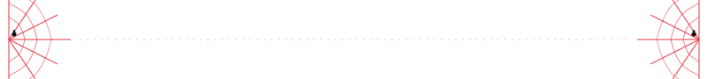

<h1 align="center">Hi, I'm Neto 👋</h1>

<h3 align="center">Jr. Front-end Developer | Tech Support | Design & Video/Photo Editing</h3>

  

  

  

### 🕸️ About me

- 🎓 Certified in **Full Stack Development** by **Inova-se (Sergipe, Brazil)**
- 💻 Working as a **Front-end Developer**, with a solid background in **tech support**
- 🎨 Also into **graphic design** and **video/photo editing**
- 🕷️ **Spider-Man** fan and active part of the **geek community**
- 🌱 23 years old, always eager to learn more about technology
- ⚡ Curiosity and constant growth are what drive me

  

### 🛠️ Tech & Tools

  

  

### 📊 GitHub Stats

  

  

### 🚀 Featured Projects

  
  
  

> See all my repositories at: [github.com/eunetxinhu?tab=repositories](https://github.com/eunetxinhu?tab=repositories)

  

### 📫 Find me online

  
  
  

  

  <i>"With great power comes great responsibility" — good code too. 🕸️</i>

